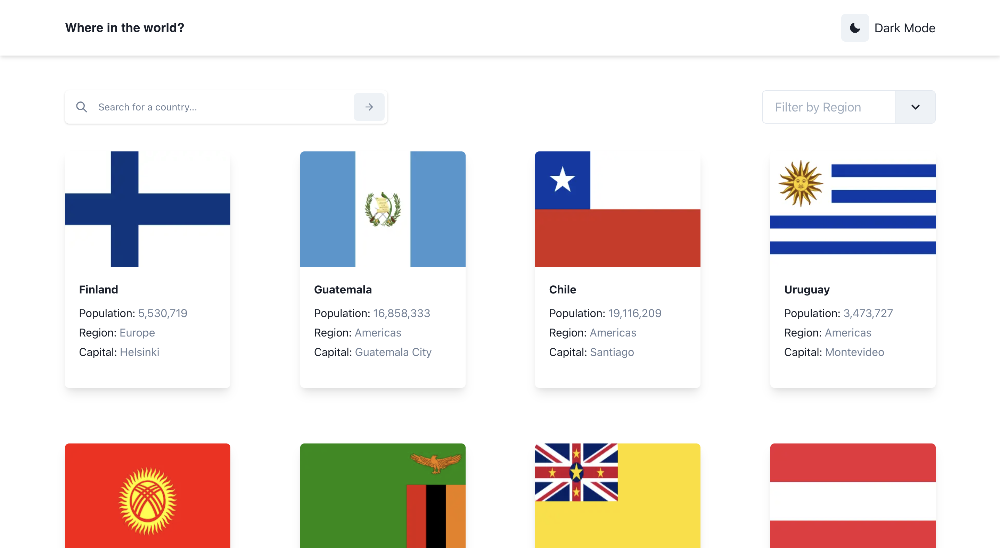

# Frontend Mentor - REST Countries API with color theme switcher

## The challenge

The challenge was to with the [REST Countries API](https://restcountries.com/) to pull country data and get it looking as close to the design as possible.

Users should be able to:

- See all countries from the API on the homepage
- Search for a country using an input field
- Filter countries by region
- Click on a country to see more detailed information on a separate page
- Click through to the border countries on the detail page
- Toggle the color scheme between light and dark mode (optional)

## Building The Project

I've just learnt NextJS and TypeScript and I'm getting better with React and Chakra-UI, so this was an opportunity to take on an ADVANCED challenge on [Frontend Mentor](https://frontendmentor.io) and really put my skills to the test. It was challenging I must say, I learnt a lot of new concepts and approaches. This particular challenge had a completion rate of ~12% on [Frontend Mentor](https://frontendmentor.io) at the time I attempted it, glad I'm now part of the 12% that were able to see it through to the end 😄

### For this project I used:

- [`REACTJS`](https://reactjs.org) as the JavaScript Frontend Library of choice so I could practice and solidify my knowledge of some important React Hooks like `useState` and `useEffect`.
- `NextJS` as the React Framework of choice so I could practice what I've learnt on `Server Side Rendering`, `Route Pre Fetching` and also get familiar with using it with `TypeScript`. I also learnt to use the `getServerSideProps` function.
- I used asynchronous `fetchAPI` to pull data from the [REST Countries API](https://restcountries.com/) and performed necessary manipulation on the data received to achieve desired results. Here I learnt more about adn improved my `JavaScript` skills on handling ddeply nested `Objects`.
- Chakra-UI was used as the UI component library of choice. It's great for creating simple, modular, and accessible React components.

## Deploying The project

The project was deployed on [Vercel](https://vercel.com/) the creator of NextJS for a seemless and stress-free deployment process. Here is [Live Link](https://countries-le4q9to4a-emmanueloloke.vercel.app/).

## Sharing The solution

- [Live Link](https://countries-le4q9to4a-emmanueloloke.vercel.app/)
- [Frontend Mentor Solution Link](https://www.frontendmentor.io/solutions/rest-countries-api-reactjs-nextjs-and-chakraui-uzTHFTJFnS)
- [Tweeted About it Here](https://twitter.com/I_am_Pope/status/1570805643589865473?s=20&t=Ri6axr7rYNRWQLsEaWihiA)
